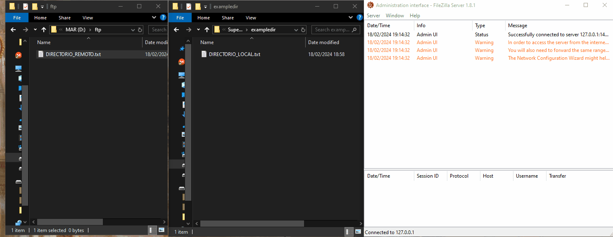
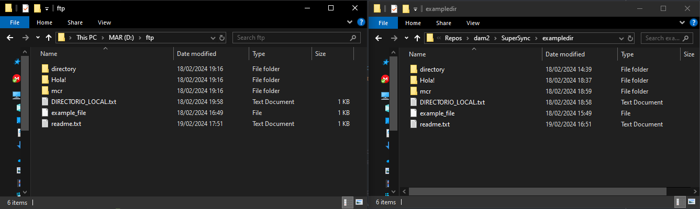
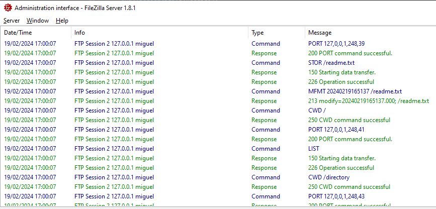
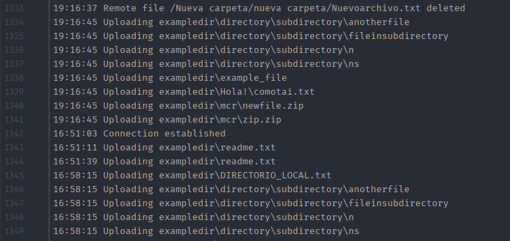
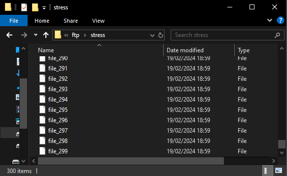
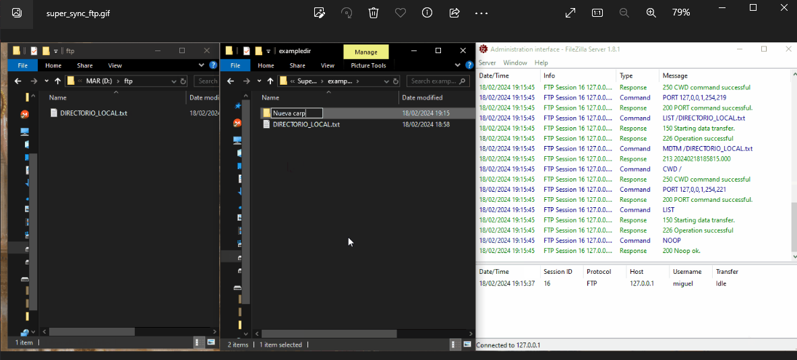

<!-- 
    class: invert
-->



---

    
## 1. 📐 Diseño

- **Enlace:** [Github](https://github.com/cakeneka/SuperSync)
- **Lenguaje de programación:** Java
- **Tamaño:** 1 clase, 263 líneas de código
- **Librerías:** Apache Commons Net y JUnit
- **Tiempo invertido:** Bastante más de 4 horas

La aplicación **sincroniza** una carpeta local con una carpeta en un servidor FTP.
La carpeta en remoto refleja **todos** los cambios de la carpeta local excepto los **directorios vacios**.

---

## 2. ⚙ Análisis del Funcionamiento

El sistema se ejecuta cada cierta cantidad de segundos (en el ejemplo anterior, 4 segundos).
Comprueba que ficheros locales han sido modificados con respecto a los ficheros remotos:

- Si el archivo local no existe en el servidor, sube el archivo local.
- Si el archivo local tiene una fecha de modificación más reciente que el archivo del servidor, sube el archivo local.
- Si tanto el archivo local como el remoto tienen la misma fecha de modificación, no se realizan cambios.

---

### Subir un archivo

Cuando subes un archivo al servidor FTP, el servidor FTP sobreescribe la fecha de modificación del archivo. 
El siguiente código crea los directorios necesarios, sube el archivo, y por último reasigna la fecha de modificación del fichero remoto.

---

```java
private void upload(File localFile) throws IOException {
    Logger.logMessage("Uploading " + localFile);
    String ftpPath = toFtpPath(localFile);

    // Crear directorios padre en el servidor si es necesario
    String ftpPathParents = ftpPath.substring(0, ftpPath.lastIndexOf('/'));
    ftpCreateDirectoryTree(ftpPathParents);
    // Subir archivo
    ftpClient.changeWorkingDirectory("/");
    InputStream is = new FileInputStream(localFile);
    ftpClient.storeFile(ftpPath, is);
    is.close();

    // Establecer la misma fecha de modificación que en el archivo local
    String ftpDate = timeStampToString(localFile.lastModified());
    ftpClient.setModificationTime(ftpPath, ftpDate);
}
```

---

### Comprobar si un archivo existe en el servidor FTP

Este método devuelve `true` si el fichero local **existe** en el servidor y tiene la misma **fecha de modificación** que en el servidor. 

```java
private boolean existsOnFtp(File file) throws IOException {
    String remotePath = toFtpPath(file);
    ftpClient.changeWorkingDirectory("/");
    FTPFile[] ftpFiles = ftpClient.listFiles(remotePath);
    if (ftpFiles.length == 0)
        return false;

    String localLastModified = timeStampToString(file.lastModified());
    String serverLastModified = ftpClient.getModificationTime(remotePath).substring(0, 14);
    return localLastModified.equals(serverLastModified);
}

```

---

### Recorrer archivos locales

Recorre archivos en la carpeta local, sube los que no existen en remoto.

```java
private void analyzeLocalDir(File dir) {
    File[] children = dir.listFiles();
    for (File child : children) {
        localFiles.add(toFtpPath(child));
        if (child.isDirectory()) {
            analyzeLocalDir(child); // Recorrer recursivamente estructura de ficheros
        } else {
            try {
                if (!existsOnFtp(child)) // subir si no existe en el servidor
                    upload(child);
            } catch (IOException e) {
                Logger.logError("Unable to upload " + child + "(" + e.getMessage() + ")");
            }
        }
    }
}
```
---

### Ejecución Repetida

El método anterior se ejecuta cada cierta cantidad de segundos, he logrado hacer esto utilizando la clase **`ScheduledExecutorService`**.
```java
public void startSync(int interval) {
    Logger.logMessage("Connection established");
    service = Executors.newSingleThreadScheduledExecutor();
    service.scheduleAtFixedRate(() -> mainLoop(), interval, interval, TimeUnit.SECONDS);
}

private void mainLoop() {
    localFiles.clear(); 
    analyzeLocalDir(syncedDir); 
    cleanRemoteDir("/");
}
```

---
### Ejecución (carpeta en local y en servidor)



---
### Ejecución (log del servidor FTP)



---
### Ejecución (log generado por el programa)



---

## 3. 🔬 Pruebas

He utilizado JUnit para realizar pruebas sobre la aplicación.
Antes de realizar cada prueba, se inicia una instancia de `SuperSync`. Cuando termina la prueba, se cierra la conexión.

### Prueba de estrés

Consiste en crear una gran cantidad de ficheros en local para comprobar que el sistema es capaz de subirlos todos en un tiempo razonable.

---

**Código** (Antes de ejecutar el test se lanza el sincronizador)
```java    
@Test
@DisplayName("Prueba de estrés")
public void test() throws IOException, InterruptedException {
    String basePath = "testdir/stress/";
    File dir = new File(basePath);
    if (dir.exists()) {
        deleteDir(dir); // Elimina directorio y sus contenidos
    }
    dir.mkdir();

    // Crea archivos en la carpeta establecida
    for (int i = 0; i < 300; i++) {
        String fileName = basePath + "file_" + i;
        File file = new File(fileName);
        file.createNewFile();
        FileWriter writer = new FileWriter(file);
        writer.write("Este el archivo de prueba " + i + " 🔥🔥🔥🔥");
    }

    // Nos aseguramos de que al sistema le dé tiempo a subir los archivos
    Thread.sleep(Duration.ofSeconds(INTERVAL * 2));
    if (dir.exists()) {
        deleteDir(dir);
    }
}
```

---

**Resultado** (300 ficheros creados en el servidor FTP)



---

### Prueba de integridad del fichero
Sube un fichero binario.

**Código**
```java
@Test
@DisplayName("Subir fichero binario")
public void binaryTest() throws IOException, InterruptedException {
    Path originalFile = Path.of("media/super_sync.gif");
    Path syncedFile = Path.of("testdir/super_sync_ftp.gif");
    Files.copy(originalFile, syncedFile, StandardCopyOption.REPLACE_EXISTING);
    Thread.sleep(Duration.ofSeconds(INTERVAL * 2));
}
```

---

**Resultado** (Fichero subido correctamente al servidor FTP)




---

## 4. 📈 Propuestas de mejora

- El servidor falla si el archivo a subir contiene caracteres especiales
- Mejorar **Seguridad** de la aplicación utilizando FTPS
- Utilizar servidor FTP **remoto** 
- Permitir sincronización de **varias carpetas**
- **interfaz gráfica** para seleccionar que carpeta sincronizar


---

## 5. 📚 Recursos

Enlaces que me han sido de utilidad:

- [Comprobar si se ha cerrado una conexión](https://stackoverflow.com/questions/13836989/properly-check-ftp-server-connection)
- [Construir una ruta relativa a partir de dos rutas absolutas](https://stackoverflow.com/questions/204784/how-to-construct-a-relative-path-in-java-from-two-absolute-paths-or-urls)
- [Crear una estructura de carpetas en el servidor FTP](https://stackoverflow.com/questions/4078642/create-a-folder-hierarchy-through-ftp-in-java)


---

<!-- class: lead -->

Martina Victoria López Quijada

2º DAM